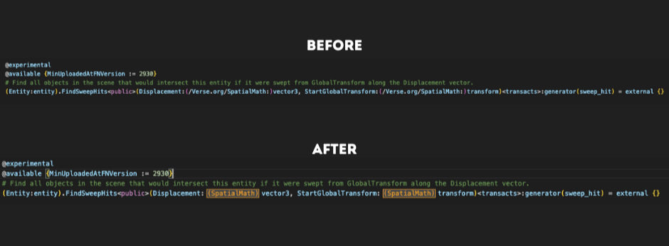

# Verse Import Decorator

A VSCode extension that shortens inline import paths in digest files to improve readability.

## Features

- Hides inline import paths in digest files.
- Shows a tooltip with the full path on hover.

## Screenshots

